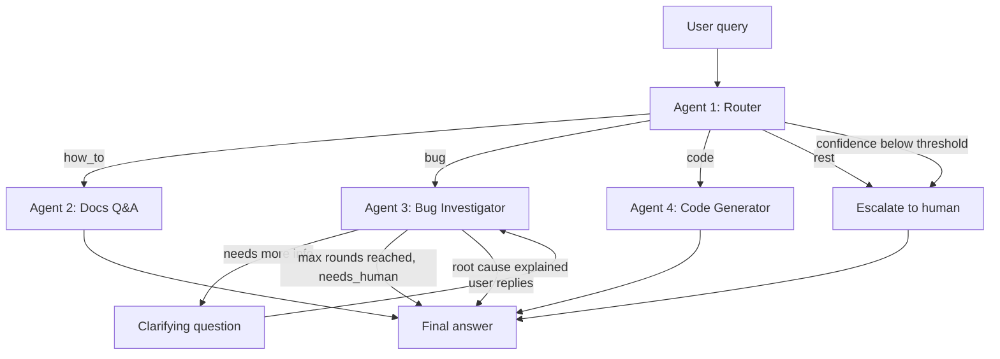

## Problem

I spent years on live-chat support for Crocoblock plugins (JetEngine,
JetFormBuilder, JetSmartFilters). This project automates the first line of that
work, so a human agent only handles what actually needs a human.

Based on that experience, client requests split into four groups:

- **how_to** — needs a precise answer grounded in current documentation.
  A plausible-but-wrong answer is worse than no answer at all: the client
  follows it, breaks something, and comes back frustrated.
- **bug** — a plugin doesn't work, or doesn't work as expected. Often it turns
  out not to be a bug at all, but the process is identical either way: ask a
  series of clarifying questions about the setup and, where possible, inspect
  the live site. In practice this meant 3-4 message round-trips before any
  diagnosis could even begin.
- **code** — functionality that can be solved with a few lines of PHP or CSS,
  extending what ships out of the box. The snippet must fit the client's actual
  environment, so it cannot be written before that environment is known.
- **rest** — anything outside the groups above: pre-sales questions, feature
  requests, feedback. No answer is expected here; it needs to reach a human.

A single prompt cannot serve all four. The agents need different tools
(documentation retrieval vs. live site access), different permissions
(read-only vs. writing code), and different success criteria (accuracy vs.
correct diagnostic questioning vs. timely escalation). Splitting them into
specialised agents keeps each prompt short and testable, and lets a small model
handle classification while only the hard cases reach a large one.

## Agents

| Agent | Responsibility | Tools | Model tier |
|---|---|---|---|
| #1 Router | Classifies the request into `how_to` / `bug` / `code` / `rest`. Returns type + confidence | — | Haiku (cheap, fast) |
| #2 Docs Q&A | Answers how-to questions from indexed plugin documentation | Pinecone retrieval + Cohere rerank | Sonnet |
| #3 Bug Investigator | Asks clarifying questions, collects environment data from the live site | MCP: `get_env_info`, `list_plugins`, `get_error_log` | Sonnet |
| #4 Code Generator | Writes PHP/CSS fixes against the collected context | Curated hook reference (`agents/knowledge/jfb_hooks.md`); reads `env_info` from state when available | Sonnet |

**Two configuration modules, on purpose.** `src/settings.py` reads and validates
the environment: one `Settings` instance, built at import time, with validators
that refuse to start when the selected provider has no key or when tracing is
enabled without one. `src/config.py` builds provider clients from those settings
and owns the model tier table. The split keeps provider SDKs out of the module
every other file imports — merging them would mean importing `langchain_anthropic`
and `langchain_google_genai` any time anything needed a timeout value.

Exact model IDs live in `src/config.py`. The provider is switchable via
`LLM_PROVIDER`, so the same graph runs on Gemini during development.

**Scope of v1:** the documentation index covers JetFormBuilder — 247 pages
scraped from the official docs, split into 1836 chunks (1000 chars, 150
overlap) and embedded with Cohere `embed-v4.0` (1536 dim) into the Pinecone
index `jetformbuilder-docs`, namespace `jfb`. JetEngine and JetSmartFilters are
additional namespaces in the same index and require no code changes to add.

## Flow

**Two independent paths to a human.** `rest` is escalated on type alone, without
consulting the confidence score — a pricing question is not something an agent
should attempt no matter how certain the classification. The threshold is the
second, separate gate: it catches messages the router *did* place in an
actionable category but could not extract enough information from. Both edges
lead to the same node, but they answer different questions — "should an agent
handle this at all" and "is there enough here to act on".

## State schema

| Field | Type | Written by | Purpose |
|---|---|---|---|
| `messages` | list | all | Conversation history |
| `query_type` | str | Router | `how_to` / `bug` / `code` / `rest` |
| `confidence` | float | Router | Classification certainty; below 0.6 → escalate |
| `routing_reason` | str | Router | One-sentence justification of the classification |
| `env_info` | dict | Bug Investigator | WP/PHP versions, active plugins, theme |
| `retrieved_docs` | list | Docs Q&A | Source URLs of the chunks used in the answer |
| `clarifying_rounds` | int | Bug Investigator | Question counter; caps the loop at 2 rounds |
| `investigation_log` | list | Bug Investigator | Question/reply pairs, replayed as context on resume |
| `final_answer` | str | any | Response to the user |
| `needs_human` | bool | any | Escalation flag for a live support agent |
| `handled_by` | str | any | Which agent produced the answer; used by the metrics suite |

## Tech stack

- **Orchestration:** LangGraph — conditional edges, `interrupt()` for
  human-in-the-loop questioning, `InMemorySaver` checkpointer for conversation
  memory
- **LLM:** Anthropic Claude (primary), Google Gemini (development) — switched
  via a single `LLM_PROVIDER` variable
- **Retrieval:** Pinecone dense search over 1836 chunks, Cohere `rerank-v3.5`
  narrowing 20 candidates down to the top 5
- **WordPress integration:** FastMCP server over the WP REST API, backed by a
  must-use plugin exposing `/env`, `/plugins`, and `/error-log`
- **Interfaces:** CLI and Streamlit, both on the same `src/runner.py`

## Measured behaviour

Full methodology and numbers live in the [README](README.md); raw output in
[`metrics/results.json`](metrics/results.json), reproducible with
`python -m tests.metrics`.

| Metric | Result |
|---|---|
| Router accuracy | 25/25 = 100% |
| Escalation correctness | 1.00 after recalibrating the confidence definition |
| Retrieval | hit rate 0.83, MRR 0.53 (12 questions, `crocoblock-retrieval`) |
| Latency: escalation → docs → code → bug | 1.2s → 11.8s → 22.9s → 29.6s |

