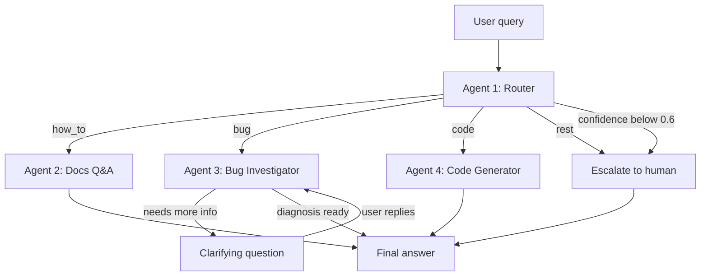

# Crocoblock AI Support Agent v2

A multi-agent system that handles first-line support for the JetFormBuilder
WordPress plugin: it classifies an incoming request, answers documentation
questions from a vector index, investigates bugs against a live WordPress
site, and writes PHP snippets — escalating to a human whenever it is not
confident enough.

Built with LangGraph. Runs on Anthropic Claude or Google Gemini, switched by a
single environment variable.

**Languages:** English · [Русский](README.ru.md) · [Українська](README.ua.md)

[](https://github.com/igorshkov93/project-7-refactor-crocoblock-support-agent-on-langgraph/actions/workflows/ci.yml)

---

## What this repository is

A working prototype turned into something that can be maintained. The agents,
the graph and the retrieval pipeline were already there; what was missing was
everything that makes a system survivable — validated configuration, a typed
codebase, structured logs, a retry policy, traces, and a test suite that runs
without touching a paid API.

| | Before | After |
|---|---|---|
| `ruff` violations | 126 | **0** |
| `mypy --strict` errors | 33 | **0** |
| `print()` in library code | 49 | **0** |
| Places reading `os.environ` | 11 | **3** |
| Automated tests | 0 (could not run) | **129, 1.4 s, no network** |
| CI | none | ruff + mypy + pytest on every push |

Full log of what was changed and why, including the defects found along the
way: [`docs/REFACTORING.md`](docs/REFACTORING.md).

## Demo

**[▶ Watch the walkthrough (Loom)](https://www.loom.com/share/12bc143caf2d446288fef600a9506836)** — the four agents on a live
WordPress site, including the one scene that matters most: the code agent
declining to write a snippet for a hook that does not exist.

---

## Why this exists

I spent years on live-chat support for Crocoblock plugins. Most of that work is
not hard — it is repetitive triage. Requests fall into four groups, and each
needs a different kind of help:

| Type | What the customer wants | What it takes to answer |
|---|---|---|
| `how_to` | How to use an existing feature | An answer grounded in current docs. A plausible-but-wrong answer is worse than none. |
| `bug` | Something is broken | Clarifying questions plus a look at the actual site. Usually 3–4 message round-trips before diagnosis begins. |
| `code` | A snippet extending the plugin | Code that fits the customer's environment and uses hooks that really exist. |
| `rest` | Pricing, licensing, feature requests | A human. |

One prompt cannot serve all four. They need different tools, different
permissions, and different definitions of success. So each is a separate agent
with a short, testable prompt — and a cheap model does the triage while only
the hard cases reach an expensive one.

## How it works



| Agent | Responsibility | Tools | Model tier |
|---|---|---|---|
| **#1 Router** | Classifies into `how_to` / `bug` / `code` / `rest`, returns confidence | Structured output (Pydantic) | fast (Haiku) |
| **#2 Docs Q&A** | Answers from indexed documentation, cites source URLs | Pinecone search + Cohere rerank | smart (Sonnet) |
| **#3 Bug Investigator** | Asks clarifying questions, reads the live site's environment and error log | MCP: `get_env_info`, `list_plugins`, `get_error_log` | smart (Sonnet) |
| **#4 Code Generator** | Writes PHP/CSS snippets | Curated hook reference; reads `env_info` from state when available | smart (Sonnet) |

Three design decisions worth calling out:

**Confidence gating.** The router returns a score alongside the class. Below
0.6 the request goes straight to a human instead of to an agent that would
guess. Vague messages like *"it doesn't work"* or *"same problem as before"*
are supposed to fail this check, and they do.

**Human-in-the-loop, not a chat loop.** The Bug Investigator uses LangGraph's
`interrupt()`. The graph genuinely suspends mid-node, the question reaches the
user, and execution resumes from the checkpoint with the reply appended to
`investigation_log`. Capped at 2 rounds, after which it hands over with
`needs_human=True`.

**The code agent refuses to invent hooks.** Its prompt contains a curated
reference of verified JetFormBuilder hooks and instructs it to say so plainly
when a task needs something outside that list. Hallucinated hook names are the
single most expensive failure mode in plugin support — they look correct and
cost the customer an afternoon.

## Results

Measured by `tests/metrics.py`, raw output in [`metrics/results.json`](metrics/results.json).
Provider: Anthropic, `claude-haiku-4-5` for routing, `claude-sonnet-5` for the rest.

**Routing** — 25 labelled requests, phrased the way customers actually write.
Run as a LangSmith experiment against the `crocoblock-routing` dataset:

| | Before | After |
|---|---|---|
| Routing accuracy | 24/25 = 96% | **25/25 = 100%** |
| Escalation correctness | 0.93 | **1.00** |

The earlier miss was a `code` request read as `how_to` — a boundary case, since
the router is told to prefer `how_to` when built-in settings would do. What
fixed it was not a bigger model but a rewritten definition of confidence, and
that story is worth telling in full below.

**Escalation** — the interesting one. In the previous version, *"форма не
работает"* scored 0.75 and was confidently routed to the bug investigator,
despite containing no diagnostic information whatsoever. The obvious diagnosis
was that confidence calibration breaks on non-English input.

That diagnosis was wrong. Two things were actually happening:

*The prompt anchored the model.* It named the 0.6 threshold explicitly, and the
model kept landing on 0.60 — precisely the value the graph compares with `<`,
which passes. Removing the number and replacing it with two bands, 0.15–0.35
and 0.75–0.95, pushed scores to the ends of the range where they belong.

*Confidence was measuring the wrong thing.* The model was scoring how sure it
was of the category, not whether the message contained enough to act on. "The
form is broken" is unambiguously a bug report — high confidence, correctly. It
is also unactionable. Redefining confidence as sufficiency of information, with
an explicit note that naming a subject is not diagnostic information, is what
moved escalation correctness from 0.93 to 1.00.

Language was never the variable. The prompt now says so outright: a detailed
report in any language scores high, a vague one in English scores low.

**Calibration turned out to be a property of the model, not the prompt.** The
same prompt on the same dataset scores 0.47 on Gemini 2.5 Flash and 0.93 on
Claude Haiku 4.5. A prompt fix cannot close that gap.

**Retrieval** — 12 questions with a known source page, run against the
`crocoblock-retrieval` dataset:

| Metric | Result |
|---|---|
| Hit rate | 0.83 |
| Mean reciprocal rank | 0.53 |

The gap between those two numbers is the story. The correct page is usually
retrieved, but often not first — and tracing one case showed reranking is
sometimes the reason.

For a question about prefilling a hidden field with the current user ID,
Pinecone returns the right page in second position with four of its chunks in
the top 20. Cohere's reranker removes all four and promotes pages about user
roles instead. The cause is upstream of the reranker: chunking splits the
documentation mid-list, so the chunk holding the literal answer opens halfway
through an enumeration and never names the thing it describes. The reranker
scores it as unrelated, which — reading only that chunk — it is.

The obvious fix, prepending the page title to each chunk's text, was
implemented, measured, and rejected: it did not improve the ranking. The real
fix is a re-indexing strategy that respects list boundaries, which is outside
what a refactor should touch. Recorded as a known limit rather than patched.

**Latency** — end-to-end, single request, no caching:

| Path | Time |
|---|---|
| Escalation | 1.2 s |
| Docs Q&A | 11.8 s |
| Code Generator | 22.9 s |
| Bug Investigator | 29.6 s to the first clarifying question |

The ordering tracks the work done: escalation is deterministic, Docs Q&A adds
two network round-trips to Cohere, code generation carries a long hook
reference in context, and the investigator calls MCP tools against a live site.

## Stack

- **Orchestration:** LangGraph — conditional edges, `interrupt()` for
  human-in-the-loop, `InMemorySaver` checkpointer for conversation memory
- **Models:** Anthropic Claude (primary), Google Gemini (development) — one
  `LLM_PROVIDER` variable switches both tiers
- **Retrieval:** 247 documentation pages → 1836 chunks (1000 chars, 150
  overlap) → Cohere `embed-v4.0` (1536 dim) → Pinecone index
  `jetformbuilder-docs`, namespace `jfb`. Search returns 20 candidates,
  Cohere `rerank-v3.5` narrows to 5.
- **WordPress integration:** a FastMCP server over the WP REST API, backed by a
  must-use plugin exposing `/env`, `/plugins`, and `/error-log`
- **Interfaces:** CLI and Streamlit, both on the same `src/runner.py`

## Getting started

Requires Python 3.12 and a WordPress site you control (Local by Flywheel works
well) with JetFormBuilder installed.

```bash
git clone https://github.com/igorshkov93/project-7-refactor-crocoblock-support-agent-on-langgraph
cd project-7-refactor-crocoblock-support-agent-on-langgraph

python -m venv .venv
.venv\Scripts\activate        # Windows
# source .venv/bin/activate   # macOS / Linux

pip install -r requirements.txt          # add -dev for ruff, mypy and pytest
cp .env.example .env          # then fill in your keys
```

Copy `src/mu-plugin/support-agent-api.php` into `wp-content/mu-plugins/` on the
target site, and create an application password for the WordPress user named in
`WP_APP_PASSWORD`.

Build the documentation index (once, ~15 minutes):

```bash
python -m src.rag.collect_urls
python -m src.rag.scrape_docs
python -m src.rag.chunk_docs
python -m src.rag.index_chunks
```

Then use it:

```bash
python -m src.cli "How do I redirect the user after submit?"
streamlit run app.py
```

Reproduce the numbers above:

```bash
python -m tests.metrics
```

## Tests

```bash
pip install -r requirements-dev.txt
pytest
```

129 tests, about 1.4 seconds, no network and no API keys — stub credentials are
injected before the first import and every outbound call is replaced. The same
three commands run in CI on every push: `ruff check .`, `mypy src app.py`,
`pytest`.

Running without keys is the point, not a convenience. A green run proves the
suite is genuinely isolated: a real call would fail on a missing key rather than
pass quietly on a machine that happens to have `.env` in place. The pipeline was
also verified in the other direction — a branch with one deliberately failing
assertion was pushed to confirm the run goes red.

Two kinds of test live under `tests/`, and they are not the same thing:

- `tests/unit/` — automated, isolated, collected by pytest.
- Everything directly under `tests/` — manual probes against live Pinecone,
  Cohere and WordPress, plus the LangSmith dataset and evaluator scripts. Run by
  hand when a real service needs checking. `testpaths` keeps pytest out of them.

## Repository layout

```
src/
  agents/          router, docs_qa, bug_investigator, code_generator
    knowledge/     curated JetFormBuilder hook reference
  rag/             scraping, chunking, indexing, two-stage retriever
  mcp_server/      FastMCP server + WP REST client
  mu-plugin/       WordPress must-use plugin exposing the sandbox endpoints
  graph.py         LangGraph assembly and routing logic
  state.py         SupportState schema
  runner.py        shared entry point for both interfaces
  cli.py           command-line interface
app.py             Streamlit chat interface
tests/             per-agent tests, labelled test sets, metrics suite
metrics/           measured results
```

Design decisions and the full state schema live in
[`ARCHITECTURE.md`](ARCHITECTURE.md).

## Known limits

- The index covers JetFormBuilder only. JetEngine and JetSmartFilters are
  additional namespaces in the same Pinecone index and need no code changes.
- `InMemorySaver` keeps conversation state in process memory: restarting the
  app clears every thread. Swapping in a persistent checkpointer is a
  configuration change, not a rewrite.
- Confidence calibration is a property of the model, not of the prompt. The
  same prompt scores 0.47 on Gemini 2.5 Flash and 0.93 on Claude Haiku 4.5, so
  the free-tier development provider cannot be trusted for routing decisions.
- Reranking occasionally demotes the correct page, because chunking splits the
  documentation mid-list. Fixing it means re-indexing, not re-ranking.
- The retry policy backs off on a fixed exponential schedule and ignores the
  `retryDelay` the provider returns. It only matters under batch evaluation
  runs, where the providers ask for 20–40 seconds and the policy waits 1–3.
  Reading the value back would mean parsing two different response formats.
- The Bug Investigator reads the site but never writes to it. Every MCP tool is
  read-only by design.
