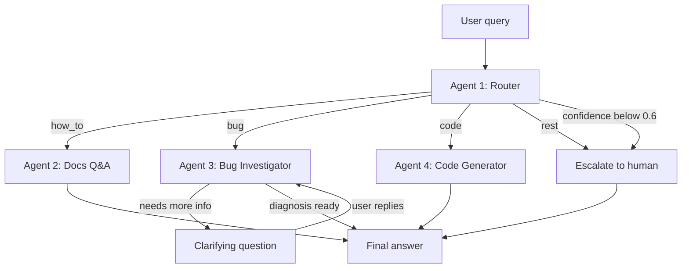

# Crocoblock AI Support Agent v2

Мультиагентная система первой линии поддержки для WordPress-плагина
JetFormBuilder: классифицирует входящий запрос, отвечает на вопросы по
документации из векторного индекса, диагностирует баги на живом
WordPress-сайте и пишет PHP-сниппеты — а если уверенности не хватает,
передаёт запрос человеку.

Построена на LangGraph. Работает на Anthropic Claude или Google Gemini,
переключение — одной переменной окружения.

**Языки:** [English](README.md) · Русский · [Українська](README.ua.md)

[](https://github.com/igorshkov93/project-7-refactor-crocoblock-support-agent-on-langgraph/actions/workflows/ci.yml)

---

## Что в этом репозитории

Рабочий прототип, доведённый до состояния, в котором его можно поддерживать.
Агенты, граф и пайплайн поиска уже существовали; не хватало всего того, без
чего система нежизнеспособна — валидируемой конфигурации, типизированного
кода, структурных логов, политики ретраев, трейсинга и тестов, которые
проходят без обращения к платному API.

| | Было | Стало |
|---|---|---|
| Нарушений `ruff` | 126 | **0** |
| Ошибок `mypy --strict` | 33 | **0** |
| `print()` в библиотечном коде | 49 | **0** |
| Точек чтения `os.environ` | 11 | **3** |
| Автотестов | 0 (не запускались) | **129, 1,4 с, без сети** |
| CI | нет | ruff + mypy + pytest на каждый push |

Полный журнал изменений и найденных по ходу дефектов:
[`docs/REFACTORING.md`](docs/REFACTORING.md).

## Демо

**[▶ Смотреть разбор (Loom)](https://www.loom.com/share/12bc143caf2d446288fef600a9506836)** — четыре агента на живом
WordPress-сайте, включая самую важную сцену: кодовый агент отказывается писать
сниппет для несуществующего хука.

---

## Зачем это нужно

Я несколько лет вёл живую поддержку плагинов Crocoblock. Бо́льшая часть этой
работы несложная — это повторяющаяся сортировка запросов. Запросы делятся на
четыре группы, и каждой нужна своя помощь:

| Тип | Что хочет клиент | Что нужно для ответа |
|---|---|---|
| `how_to` | Как пользоваться существующей функцией | Ответ, опирающийся на актуальную документацию. Правдоподобный, но неверный ответ хуже, чем никакого. |
| `bug` | Что-то сломалось | Уточняющие вопросы плюс взгляд на сам сайт. Обычно 3–4 круга переписки до начала диагностики. |
| `code` | Сниппет, расширяющий плагин | Код под окружение клиента и с хуками, которые реально существуют. |
| `rest` | Цены, лицензии, пожелания к продукту | Человек. |

Один промпт не покрывает все четыре случая. Им нужны разные инструменты, разные
права и разные критерии успеха. Поэтому каждый — отдельный агент с коротким и
проверяемым промптом, а сортировку делает дешёвая модель: до дорогой доходят
только сложные случаи.

## Как это работает



| Агент | Зона ответственности | Инструменты | Тир модели |
|---|---|---|---|
| **#1 Router** | Классифицирует в `how_to` / `bug` / `code` / `rest`, возвращает confidence | Структурированный вывод (Pydantic) | fast (Haiku) |
| **#2 Docs Q&A** | Отвечает по проиндексированной документации, указывает URL источников | Поиск в Pinecone + реранк Cohere | smart (Sonnet) |
| **#3 Bug Investigator** | Задаёт уточняющие вопросы, читает окружение и лог ошибок живого сайта | MCP: `get_env_info`, `list_plugins`, `get_error_log` | smart (Sonnet) |
| **#4 Code Generator** | Пишет PHP/CSS-сниппеты | Выверенный справочник хуков; читает `env_info` из состояния, если он есть | smart (Sonnet) |

Три проектных решения, о которых стоит сказать отдельно:

**Порог уверенности.** Роутер возвращает оценку вместе с классом. Ниже 0.6
запрос идёт напрямую человеку, а не агенту, который начнёт угадывать.
Расплывчатые сообщения вроде *«не работает»* или *«та же проблема, что и
раньше»* должны эту проверку не проходить — и не проходят.

**Человек в цикле, а не цикл чата.** Bug Investigator использует
`interrupt()` из LangGraph. Граф действительно приостанавливается посреди узла,
вопрос доходит до пользователя, а исполнение возобновляется с чекпоинта, дописав
ответ в `investigation_log`. Ограничение — 2 круга, после чего запрос уходит
человеку с `needs_human=True`.

**Кодовый агент не выдумывает хуки.** В его промпте лежит выверенный
справочник проверенных хуков JetFormBuilder и указание прямо говорить, когда
задача требует чего-то за пределами этого списка. Выдуманные имена хуков —
самая дорогая ошибка в поддержке плагинов: выглядят правильно и стоят клиенту
рабочего дня.

## Результаты

Замеры — `tests/metrics.py`, сырой вывод в [`metrics/results.json`](metrics/results.json).
Провайдер: Anthropic, `claude-haiku-4-5` для роутинга, `claude-sonnet-5` для остального.

**Роутинг** — 25 размеченных запросов, сформулированных так, как их пишут
реальные клиенты. Прогон как эксперимент LangSmith на датасете
`crocoblock-routing`:

| | Было | Стало |
|---|---|---|
| Точность роутинга | 24/25 = 96% | **25/25 = 100%** |
| Корректность эскалации | 0,93 | **1,00** |

Единственная прежняя ошибка — запрос типа `code`, прочитанный как `how_to`;
пограничный случай, поскольку роутеру предписано предпочитать `how_to`, когда
задача решается встроенными настройками. Исправила её не модель побольше, а
переписанное определение confidence — эту историю стоит рассказать целиком.

**Эскалация** — самое интересное. В прошлой версии сообщение *«форма не
работает»* получало 0,75 и уверенно уходило к bug investigator, хотя не
содержало ровно никакой диагностической информации. Напрашивался вывод, что
калибровка уверенности ломается на неанглийском вводе.

Вывод оказался неверным. На деле происходило две вещи.

*Промпт якорил модель.* В нём был явно назван порог 0.6 — и модель раз за разом
выдавала ровно 0.60, то самое значение, которое граф сравнивает через `<` и
которое проходит. Мы убрали число и заменили его двумя диапазонами, 0.15–0.35 и
0.75–0.95, — оценки разъехались к краям шкалы, где им и место.

*Confidence измеряла не то.* Модель оценивала, насколько она уверена в
категории, а не достаточно ли в сообщении информации, чтобы действовать.
«Форма не работает» — однозначно баг-репорт, и высокая уверенность здесь
формально верна. При этом действовать по нему невозможно. Переопределение
confidence как достаточности информации — с явной оговоркой, что назвать
предмет не значит описать симптом, — и подняло корректность эскалации с 0,93
до 1,00.

Язык переменной не был никогда. Теперь промпт говорит об этом прямо: подробный
отчёт на любом языке получает высокую оценку, расплывчатый на английском —
низкую.

**Калибровка оказалась свойством модели, а не промпта.** Один и тот же промпт
на одном и том же датасете даёт 0,47 на Gemini 2.5 Flash и 0,93 на Claude
Haiku 4.5. Правкой промпта этот разрыв не закрыть.

**Поиск** — 12 вопросов с заранее известной страницей-источником, прогон на
датасете `crocoblock-retrieval`:

| Метрика | Результат |
|---|---|
| Hit rate | 0,83 |
| Mean reciprocal rank | 0,53 |

Разрыв между этими двумя числами и есть суть. Нужная страница обычно
находится, но часто не первой — и разбор одного случая показал, что иногда
виноват реранк.

На вопрос о предзаполнении скрытого поля идентификатором текущего пользователя
Pinecone отдаёт нужную страницу второй позицией, причём четыре её чанка попадают
в топ-20. Реранкер Cohere вычищает все четыре и поднимает вместо них страницы о
ролях пользователей. Причина лежит до реранкера: нарезка рвёт документацию
посреди списка, поэтому чанк с буквальным ответом начинается с середины
перечисления и ни разу не называет то, что описывает. Реранкер считает его
нерелевантным — и, читая один этот чанк, он прав.

Напрашивающееся решение — добавить заголовок страницы к тексту каждого чанка —
было реализовано, замерено и отвергнуто: ранжирование не улучшилось. Настоящее
исправление — стратегия переиндексации, уважающая границы списков, а это уже за
рамками рефакторинга. Записано как известное ограничение, а не залатано.

**Латентность** — сквозная, один запрос, без кеширования:

| Путь | Время |
|---|---|
| Эскалация | 1,2 с |
| Docs Q&A | 11,8 с |
| Code Generator | 22,9 с |
| Bug Investigator | 29,6 с до первого уточняющего вопроса |

Порядок повторяет объём работы: эскалация детерминирована, Docs Q&A добавляет
два сетевых обращения к Cohere, генерация кода тащит в контексте длинный
справочник хуков, а investigator вызывает MCP-инструменты на живом сайте.

## Стек

- **Оркестрация:** LangGraph — условные рёбра, `interrupt()` для человека в
  цикле, чекпоинтер `InMemorySaver` для памяти диалога
- **Модели:** Anthropic Claude (основной), Google Gemini (разработка) — обоими
  тирами управляет одна переменная `LLM_PROVIDER`
- **Поиск:** 247 страниц документации → 1836 чанков (1000 символов, перекрытие
  150) → Cohere `embed-v4.0` (1536 измерений) → индекс Pinecone
  `jetformbuilder-docs`, неймспейс `jfb`. Поиск возвращает 20 кандидатов,
  Cohere `rerank-v3.5` сужает до 5.
- **Интеграция с WordPress:** FastMCP-сервер поверх WP REST API, за которым
  стоит must-use плагин с эндпоинтами `/env`, `/plugins` и `/error-log`
- **Интерфейсы:** CLI и Streamlit, оба поверх общего `src/runner.py`


## Установка и запуск

Нужны Python 3.12 и подконтрольный вам WordPress-сайт (хорошо подходит Local by
Flywheel) с установленным JetFormBuilder.

```bash
git clone https://github.com/igorshkov93/project-7-refactor-crocoblock-support-agent-on-langgraph
cd project-7-refactor-crocoblock-support-agent-on-langgraph
python -m venv .venv
.venv\Scripts\activate        # Windows
# source .venv/bin/activate   # macOS / Linux
pip install -r requirements.txt          # -dev добавит ruff, mypy и pytest
cp .env.example .env          # затем впишите свои ключи
```

Скопируйте `src/mu-plugin/support-agent-api.php` в `wp-content/mu-plugins/` на
целевом сайте и создайте application password для пользователя WordPress,
указанного в `WP_APP_PASSWORD`.

Соберите индекс документации (один раз, ~15 минут):

```bash
python -m src.rag.collect_urls
python -m src.rag.scrape_docs
python -m src.rag.chunk_docs
python -m src.rag.index_chunks
```

Дальше можно пользоваться:

```bash
python -m src.cli "How do I redirect the user after submit?"
streamlit run app.py
```

Воспроизвести цифры выше:

```bash
python -m tests.metrics
```

## Тесты

```bash
pip install -r requirements-dev.txt
pytest
```

129 тестов, около 1,4 секунды, без сети и без API-ключей: подставные учётные
данные внедряются до первого импорта, а все исходящие вызовы заменены. Те же
три команды выполняются в CI на каждый push: `ruff check .`, `mypy src app.py`,
`pytest`.

Прогон без ключей — это не удобство, а смысл. Зелёный результат доказывает, что
тесты действительно изолированы: настоящий вызов упал бы на отсутствующем ключе,
а не прошёл бы незаметно на машине, где случайно лежит `.env`. Пайплайн проверен
и в обратную сторону — ветка с одним намеренно падающим утверждением была
запушена, чтобы убедиться, что прогон краснеет.

В `tests/` живут два разных вида тестов, и путать их не стоит:

- `tests/unit/` — автоматические, изолированные, собираются pytest.
- Всё, что лежит прямо в `tests/`, — ручные пробы против живых Pinecone, Cohere
  и WordPress, плюс скрипты датасетов и evaluator'ов LangSmith. Запускаются
  руками, когда нужно проверить реальный сервис. `testpaths` не пускает туда
  pytest.

## Структура репозитория

```
src/
  agents/          router, docs_qa, bug_investigator, code_generator
    knowledge/     выверенный справочник хуков JetFormBuilder
  rag/             скрейпинг, нарезка, индексация, двухстадийный retriever
  mcp_server/      FastMCP-сервер + клиент WP REST
  mu-plugin/       must-use плагин WordPress с эндпоинтами песочницы
  graph.py         сборка графа LangGraph и логика роутинга
  state.py         схема SupportState
  runner.py        общая точка входа для обоих интерфейсов
  cli.py           интерфейс командной строки
app.py             чат-интерфейс на Streamlit
tests/             тесты по агентам, размеченные датасеты, набор метрик
metrics/           результаты замеров
```

Проектные решения и полная схема состояния — в
[`ARCHITECTURE.md`](ARCHITECTURE.md).

## Известные ограничения

- Индекс покрывает только JetFormBuilder. JetEngine и JetSmartFilters — это
  дополнительные неймспейсы в том же индексе Pinecone, изменений в коде они не
  требуют.
- `InMemorySaver` держит состояние диалога в памяти процесса: перезапуск
  приложения стирает все треды. Замена на постоянный чекпоинтер — вопрос
  конфигурации, а не переписывания.
- Калибровка уверенности — свойство модели, а не промпта. Один и тот же промпт
  даёт 0,47 на Gemini 2.5 Flash и 0,93 на Claude Haiku 4.5, так что бесплатному
  провайдеру для разработки нельзя доверять решения о маршрутизации.
- Реранк иногда опускает правильную страницу, потому что нарезка рвёт
  документацию посреди списка. Исправление — переиндексация, а не другой
  реранкер.
- Политика ретраев отступает по фиксированной экспоненте и игнорирует
  `retryDelay`, который возвращает провайдер. Это важно только на батч-прогонах
  оценки, где провайдеры просят 20–40 секунд, а политика ждёт 1–3. Чтобы читать
  это значение, пришлось бы разбирать два разных формата ответа.
- Bug Investigator читает сайт, но никогда в него не пишет. Все MCP-инструменты
  доступны только на чтение — так задумано.