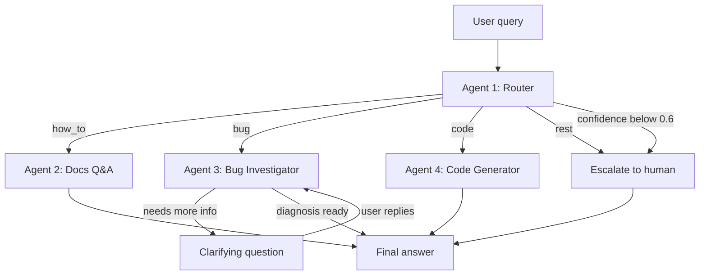

# Crocoblock AI Support Agent v2

Мультиагентная система первой линии поддержки для WordPress-плагина
JetFormBuilder: классифицирует входящий запрос, отвечает на вопросы по
документации из векторного индекса, диагностирует баги на живом
WordPress-сайте и пишет PHP-сниппеты — а если уверенности не хватает,
передаёт запрос человеку.

Построена на LangGraph. Работает на Anthropic Claude или Google Gemini,
переключение — одной переменной окружения.

**Языки:** [English](README.md) · Русский · [Українська](README.ua.md)

---

## Что в этом репозитории

Рабочий прототип, доведённый до состояния, в котором его можно поддерживать.
Агенты, граф и пайплайн поиска уже существовали; не хватало всего того, без
чего система нежизнеспособна — валидируемой конфигурации, типизированного
кода, структурных логов, политики ретраев, трейсинга и тестов, которые
проходят без обращения к платному API.

| | Было | Стало |
|---|---|---|
| Нарушений `ruff` | 126 | **0** |
| Ошибок `mypy --strict` | 33 | **0** |
| `print()` в библиотечном коде | 49 | **0** |
| Точек чтения `os.environ` | 11 | **3** |
| Автотестов | 0 (не запускались) | **129, 1,4 с, без сети** |
| CI | нет | ruff + mypy + pytest на каждый push |

Полный журнал изменений и найденных по ходу дефектов:
[`docs/REFACTORING.md`](docs/REFACTORING.md).

## Демо

**[▶ Смотреть разбор (Loom)](https://www.loom.com/share/12bc143caf2d446288fef600a9506836)** — четыре агента на живом
WordPress-сайте, включая самую важную сцену: кодовый агент отказывается писать
сниппет для несуществующего хука.

---

## Зачем это нужно

Я несколько лет вёл живую поддержку плагинов Crocoblock. Бо́льшая часть этой
работы несложная — это повторяющаяся сортировка запросов. Запросы делятся на
четыре группы, и каждой нужна своя помощь:

| Тип | Что хочет клиент | Что нужно для ответа |
|---|---|---|
| `how_to` | Как пользоваться существующей функцией | Ответ, опирающийся на актуальную документацию. Правдоподобный, но неверный ответ хуже, чем никакого. |
| `bug` | Что-то сломалось | Уточняющие вопросы плюс взгляд на сам сайт. Обычно 3–4 круга переписки до начала диагностики. |
| `code` | Сниппет, расширяющий плагин | Код под окружение клиента и с хуками, которые реально существуют. |
| `rest` | Цены, лицензии, пожелания к продукту | Человек. |

Один промпт не покрывает все четыре случая. Им нужны разные инструменты, разные
права и разные критерии успеха. Поэтому каждый — отдельный агент с коротким и
проверяемым промптом, а сортировку делает дешёвая модель: до дорогой доходят
только сложные случаи.

## Как это работает

| Агент | Зона ответственности | Инструменты | Тир модели |
|---|---|---|---|
| **#1 Router** | Классифицирует в `how_to` / `bug` / `code` / `rest`, возвращает confidence | Структурированный вывод (Pydantic) | fast (Haiku) |
| **#2 Docs Q&A** | Отвечает по проиндексированной документации, указывает URL источников | Поиск в Pinecone + реранк Cohere | smart (Sonnet) |
| **#3 Bug Investigator** | Задаёт уточняющие вопросы, читает окружение и лог ошибок живого сайта | MCP: `get_env_info`, `list_plugins`, `get_error_log` | smart (Sonnet) |
| **#4 Code Generator** | Пишет PHP/CSS-сниппеты | Выверенный справочник хуков; читает `env_info` из состояния, если он есть | smart (Sonnet) |

Три проектных решения, о которых стоит сказать отдельно:

**Порог уверенности.** Роутер возвращает оценку вместе с классом. Ниже 0.6
запрос идёт напрямую человеку, а не агенту, который начнёт угадывать.
Расплывчатые сообщения вроде *«не работает»* или *«та же проблема, что и
раньше»* должны эту проверку не проходить — и не проходят.

**Человек в цикле, а не цикл чата.** Bug Investigator использует
`interrupt()` из LangGraph. Граф действительно приостанавливается посреди узла,
вопрос доходит до пользователя, а исполнение возобновляется с чекпоинта, дописав
ответ в `investigation_log`. Ограничение — 2 круга, после чего запрос уходит
человеку с `needs_human=True`.

**Кодовый агент не выдумывает хуки.** В его промпте лежит выверенный
справочник проверенных хуков JetFormBuilder и указание прямо говорить, когда
задача требует чего-то за пределами этого списка. Выдуманные имена хуков —
самая дорогая ошибка в поддержке плагинов: выглядят правильно и стоят клиенту
рабочего дня.

## Результаты

Замеры — `tests/metrics.py`, сырой вывод в [`metrics/results.json`](metrics/results.json).
