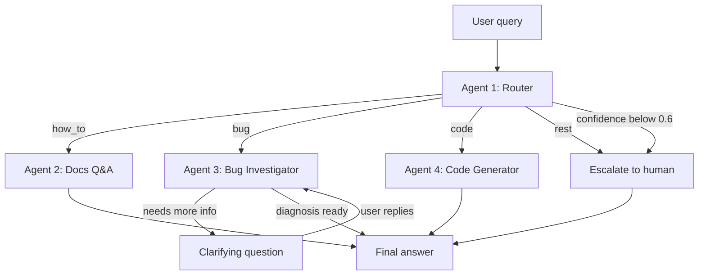

# Crocoblock AI Support Agent v2

Мультиагентна система першої лінії підтримки для WordPress-плагіна
JetFormBuilder: класифікує вхідний запит, відповідає на питання з документації
з векторного індексу, діагностує баги на живому WordPress-сайті та пише
PHP-сніпети — а коли впевненості бракує, передає запит людині.

Побудована на LangGraph. Працює на Anthropic Claude або Google Gemini,
перемикання — однією змінною середовища.

**Мови:** [English](README.md) · [Русский](README.ru.md) · Українська

[](https://github.com/igorshkov93/project-7-refactor-crocoblock-support-agent-on-langgraph/actions/workflows/ci.yml)

---

## Що в цьому репозиторії

Робочий прототип, доведений до стану, у якому його можна підтримувати. Агенти,
граф і пайплайн пошуку вже існували; бракувало всього того, без чого система
нежиттєздатна — валідованої конфігурації, типізованого коду, структурних логів,
політики ретраїв, трейсингу та тестів, які проходять без звернення до платного
API.

| | Було | Стало |
|---|---|---|
| Порушень `ruff` | 126 | **0** |
| Помилок `mypy --strict` | 33 | **0** |
| `print()` у бібліотечному коді | 49 | **0** |
| Точок читання `os.environ` | 11 | **3** |
| Автотестів | 0 (не запускалися) | **129, 1,4 с, без мережі** |
| CI | немає | ruff + mypy + pytest на кожен push |

Повний журнал змін і знайдених дорогою дефектів:
[`docs/REFACTORING.md`](docs/REFACTORING.md).

## Демо

**[▶ Дивитися розбір (Loom)](https://www.loom.com/share/12bc143caf2d446288fef600a9506836)** — чотири агенти на живому
WordPress-сайті, включно з найважливішою сценою: кодовий агент відмовляється
писати сніпет для неіснуючого хука.

---

## Навіщо це потрібно

Я кілька років вів живу підтримку плагінів Crocoblock. Більша частина цієї
роботи нескладна — це повторюване сортування запитів. Запити діляться на
чотири групи, і кожній потрібна своя допомога:

| Тип | Чого хоче клієнт | Що потрібно для відповіді |
|---|---|---|
| `how_to` | Як користуватися наявною функцією | Відповідь, що спирається на актуальну документацію. Правдоподібна, але хибна відповідь гірша за жодну. |
| `bug` | Щось зламалося | Уточнювальні питання плюс погляд на сам сайт. Зазвичай 3–4 кола листування до початку діагностики. |
| `code` | Сніпет, що розширює плагін | Код під оточення клієнта і з хуками, які справді існують. |
| `rest` | Ціни, ліцензії, побажання до продукту | Людина. |

Один промпт не покриває всі чотири випадки. Їм потрібні різні інструменти,
різні права та різні критерії успіху. Тому кожен — окремий агент із коротким і
перевірюваним промптом, а сортування робить дешева модель: до дорогої доходять
лише складні випадки.

## Як це працює



| Агент | Зона відповідальності | Інструменти | Тир моделі |
|---|---|---|---|
| **#1 Router** | Класифікує в `how_to` / `bug` / `code` / `rest`, повертає confidence | Структурований вивід (Pydantic) | fast (Haiku) |
| **#2 Docs Q&A** | Відповідає за проіндексованою документацією, вказує URL джерел | Пошук у Pinecone + реранк Cohere | smart (Sonnet) |
| **#3 Bug Investigator** | Ставить уточнювальні питання, читає оточення та лог помилок живого сайту | MCP: `get_env_info`, `list_plugins`, `get_error_log` | smart (Sonnet) |
| **#4 Code Generator** | Пише PHP/CSS-сніпети | Вивірений довідник хуків; читає `env_info` зі стану, якщо він є | smart (Sonnet) |

Три проєктні рішення, про які варто сказати окремо:

**Поріг упевненості.** Роутер повертає оцінку разом із класом. Нижче 0.6 запит
іде напряму людині, а не агенту, який почне вгадувати. Розпливчасті
повідомлення на кшталт *«не працює»* або *«та сама проблема, що й раніше»*
мають цю перевірку не проходити — і не проходять.

**Людина в циклі, а не цикл чату.** Bug Investigator використовує
`interrupt()` з LangGraph. Граф справді призупиняється посеред вузла, питання
доходить до користувача, а виконання відновлюється з чекпоінта, дописавши
відповідь у `investigation_log`. Обмеження — 2 кола, після чого запит іде
людині з `needs_human=True`.

**Кодовий агент не вигадує хуки.** У його промпті лежить вивірений довідник
перевірених хуків JetFormBuilder і вказівка прямо казати, коли завдання
потребує чогось поза цим списком. Вигадані імена хуків — найдорожча помилка в
підтримці плагінів: виглядають правильно і коштують клієнту робочого дня.

## Результати

Заміри — `tests/metrics.py`, сирий вивід у [`metrics/results.json`](metrics/results.json).
Провайдер: Anthropic, `claude-haiku-4-5` для роутингу, `claude-sonnet-5` для решти.

**Роутинг** — 25 розмічених запитів, сформульованих так, як їх пишуть реальні
клієнти. Прогін як експеримент LangSmith на датасеті `crocoblock-routing`:

| | Було | Стало |
|---|---|---|
| Точність роутингу | 24/25 = 96% | **25/25 = 100%** |
| Коректність ескалації | 0,93 | **1,00** |

Єдина колишня помилка — запит типу `code`, прочитаний як `how_to`; межовий
випадок, оскільки роутеру приписано віддавати перевагу `how_to`, коли завдання
розв'язується вбудованими налаштуваннями. Виправила її не більша модель, а
переписане визначення confidence — цю історію варто розповісти повністю.

**Ескалація** — найцікавіше. У минулій версії повідомлення *«форма не
працює»* отримувало 0,75 і впевнено йшло до bug investigator, хоча не містило
рівно жодної діагностичної інформації. Напрошувався висновок, що калібрування
впевненості ламається на неанглійському вводі.

Висновок виявився хибним. Насправді відбувалися дві речі.

*Промпт якорив модель.* У ньому був явно названий поріг 0.6 — і модель раз за
разом видавала рівно 0.60, те саме значення, яке граф порівнює через `<` і яке
проходить. Ми прибрали число й замінили його двома діапазонами, 0.15–0.35 і
0.75–0.95, — оцінки роз'їхалися до країв шкали, де їм і місце.

*Confidence вимірювала не те.* Модель оцінювала, наскільки вона впевнена в
категорії, а не чи достатньо в повідомленні інформації, щоб діяти. «Форма не
працює» — однозначно баг-репорт, і висока впевненість тут формально правильна.
При цьому діяти за ним неможливо. Перевизначення confidence як достатності
інформації — з явним застереженням, що назвати предмет не означає описати
симптом, — і підняло коректність ескалації з 0,93 до 1,00.

Мова змінною не була ніколи. Тепер промпт каже про це прямо: докладний звіт
будь-якою мовою отримує високу оцінку, розпливчастий англійською — низьку.

**Калібрування виявилося властивістю моделі, а не промпта.** Один і той самий
промпт на одному й тому самому датасеті дає 0,47 на Gemini 2.5 Flash і 0,93 на
Claude Haiku 4.5. Правкою промпта цей розрив не закрити.

**Пошук** — 12 питань із заздалегідь відомою сторінкою-джерелом, прогін на
датасеті `crocoblock-retrieval`:

| Метрика | Результат |
|---|---|
| Hit rate | 0,83 |
| Mean reciprocal rank | 0,53 |

Розрив між цими двома числами і є суттю. Потрібна сторінка зазвичай
знаходиться, але часто не першою — і розбір одного випадку показав, що іноді
винен реранк.

На питання про попереднє заповнення прихованого поля ідентифікатором поточного
користувача Pinecone віддає потрібну сторінку другою позицією, причому чотири
її чанки потрапляють у топ-20. Реранкер Cohere вичищає всі чотири й підіймає
натомість сторінки про ролі користувачів. Причина лежить до реранкера: нарізка
рве документацію посеред списку, тому чанк із буквальною відповіддю починається
з середини переліку й жодного разу не називає те, що описує. Реранкер вважає
його нерелевантним — і, читаючи лише цей чанк, він має рацію.

Рішення, що напрошувалося, — додати заголовок сторінки до тексту кожного чанка
— було реалізоване, заміряне й відкинуте: ранжування не покращилося. Справжнє
виправлення — стратегія переіндексації, що поважає межі списків, а це вже поза
рамками рефакторингу. Записано як відоме обмеження, а не залатано.

**Латентність** — наскрізна, один запит, без кешування:

| Шлях | Час |
|---|---|
| Ескалація | 1,2 с |
| Docs Q&A | 11,8 с |
| Code Generator | 22,9 с |
| Bug Investigator | 29,6 с до першого уточнювального питання |

Порядок повторює обсяг роботи: ескалація детермінована, Docs Q&A додає два
мережеві звернення до Cohere, генерація коду тягне в контексті довгий довідник
хуків, а investigator викликає MCP-інструменти на живому сайті.

## Стек

- **Оркестрація:** LangGraph — умовні ребра, `interrupt()` для людини в циклі,
  чекпоінтер `InMemorySaver` для пам'яті діалогу
- **Моделі:** Anthropic Claude (основний), Google Gemini (розробка) — обома
  тирами керує одна змінна `LLM_PROVIDER`
- **Пошук:** 247 сторінок документації → 1836 чанків (1000 символів, перекриття
  150) → Cohere `embed-v4.0` (1536 вимірів) → індекс Pinecone
  `jetformbuilder-docs`, неймспейс `jfb`. Пошук повертає 20 кандидатів,
  Cohere `rerank-v3.5` звужує до 5.
- **Інтеграція з WordPress:** FastMCP-сервер поверх WP REST API, за яким стоїть
  must-use плагін з ендпоінтами `/env`, `/plugins` та `/error-log`
- **Інтерфейси:** CLI і Streamlit, обидва поверх спільного `src/runner.py`

## Встановлення та запуск

Потрібні Python 3.12 і підконтрольний вам WordPress-сайт (добре підходить Local
by Flywheel) зі встановленим JetFormBuilder.

```bash
git clone https://github.com/igorshkov93/project-7-refactor-crocoblock-support-agent-on-langgraph
cd project-7-refactor-crocoblock-support-agent-on-langgraph
python -m venv .venv
.venv\Scripts\activate        # Windows
# source .venv/bin/activate   # macOS / Linux
pip install -r requirements.txt          # -dev додасть ruff, mypy і pytest
cp .env.example .env          # потім впишіть свої ключі
```

Скопіюйте `src/mu-plugin/support-agent-api.php` до `wp-content/mu-plugins/` на
цільовому сайті та створіть application password для користувача WordPress,
зазначеного в `WP_APP_PASSWORD`.

Зберіть індекс документації (один раз, ~15 хвилин):

```bash
python -m src.rag.collect_urls
python -m src.rag.scrape_docs
python -m src.rag.chunk_docs
python -m src.rag.index_chunks
```

Далі можна користуватися:

```bash
python -m src.cli "How do I redirect the user after submit?"
streamlit run app.py
```

Відтворити цифри вище:

```bash
python -m tests.metrics
```

## Тести

```bash
pip install -r requirements-dev.txt
pytest
```

129 тестів, близько 1,4 секунди, без мережі та без API-ключів: підставні облікові
дані впроваджуються до першого імпорту, а всі вихідні виклики замінені. Ті самі
три команди виконуються в CI на кожен push: `ruff check .`, `mypy src app.py`,
`pytest`.

Прогін без ключів — це не зручність, а сенс. Зелений результат доводить, що
тести справді ізольовані: справжній виклик впав би на відсутньому ключі, а не
пройшов би непомітно на машині, де випадково лежить `.env`. Пайплайн перевірено
і у зворотний бік — гілку з одним навмисно хибним твердженням було запушено, щоб
переконатися, що прогін червоніє.

У `tests/` живуть два різні види тестів, і плутати їх не варто:

- `tests/unit/` — автоматичні, ізольовані, збираються pytest.
- Усе, що лежить прямо в `tests/`, — ручні проби проти живих Pinecone, Cohere
  та WordPress, плюс скрипти датасетів і evaluator'ів LangSmith. Запускаються
  руками, коли треба перевірити реальний сервіс. `testpaths` не пускає туди
  pytest.

## Структура репозиторію

```
src/
  agents/          router, docs_qa, bug_investigator, code_generator
    knowledge/     вивірений довідник хуків JetFormBuilder
  rag/             скрейпінг, нарізка, індексація, двостадійний retriever
  mcp_server/      FastMCP-сервер + клієнт WP REST
  mu-plugin/       must-use плагін WordPress з ендпоінтами пісочниці
  graph.py         збірка графа LangGraph і логіка роутингу
  state.py         схема SupportState
  runner.py        спільна точка входу для обох інтерфейсів
  cli.py           інтерфейс командного рядка
app.py             чат-інтерфейс на Streamlit
tests/             тести за агентами, розмічені датасети, набір метрик
metrics/           результати замірів
```

Проєктні рішення та повна схема стану — в
[`ARCHITECTURE.md`](ARCHITECTURE.md).

## Відомі обмеження

- Індекс покриває лише JetFormBuilder. JetEngine і JetSmartFilters — це
  додаткові неймспейси в тому самому індексі Pinecone, змін у коді вони не
  потребують.
- `InMemorySaver` тримає стан діалогу в пам'яті процесу: перезапуск застосунку
  стирає всі треди. Заміна на постійний чекпоінтер — питання конфігурації, а не
  переписування.
- Калібрування впевненості — властивість моделі, а не промпта. Один і той самий
  промпт дає 0,47 на Gemini 2.5 Flash і 0,93 на Claude Haiku 4.5, тож
  безкоштовному провайдеру для розробки не можна довіряти рішення про
  маршрутизацію.
- Реранк іноді опускає правильну сторінку, бо нарізка рве документацію посеред
  списку. Виправлення — переіндексація, а не інший реранкер.
- Політика ретраїв відступає за фіксованою експонентою й ігнорує `retryDelay`,
  який повертає провайдер. Це важливо лише на батч-прогонах оцінки, де
  провайдери просять 20–40 секунд, а політика чекає 1–3. Щоб читати це значення,
  довелося б розбирати два різні формати відповіді.
- Bug Investigator читає сайт, але ніколи в нього не пише. Усі MCP-інструменти
  доступні лише на читання — так задумано.